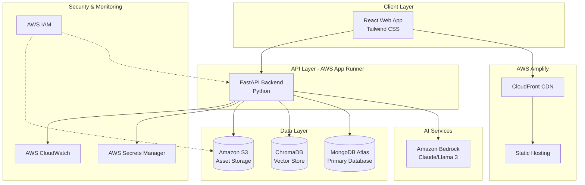
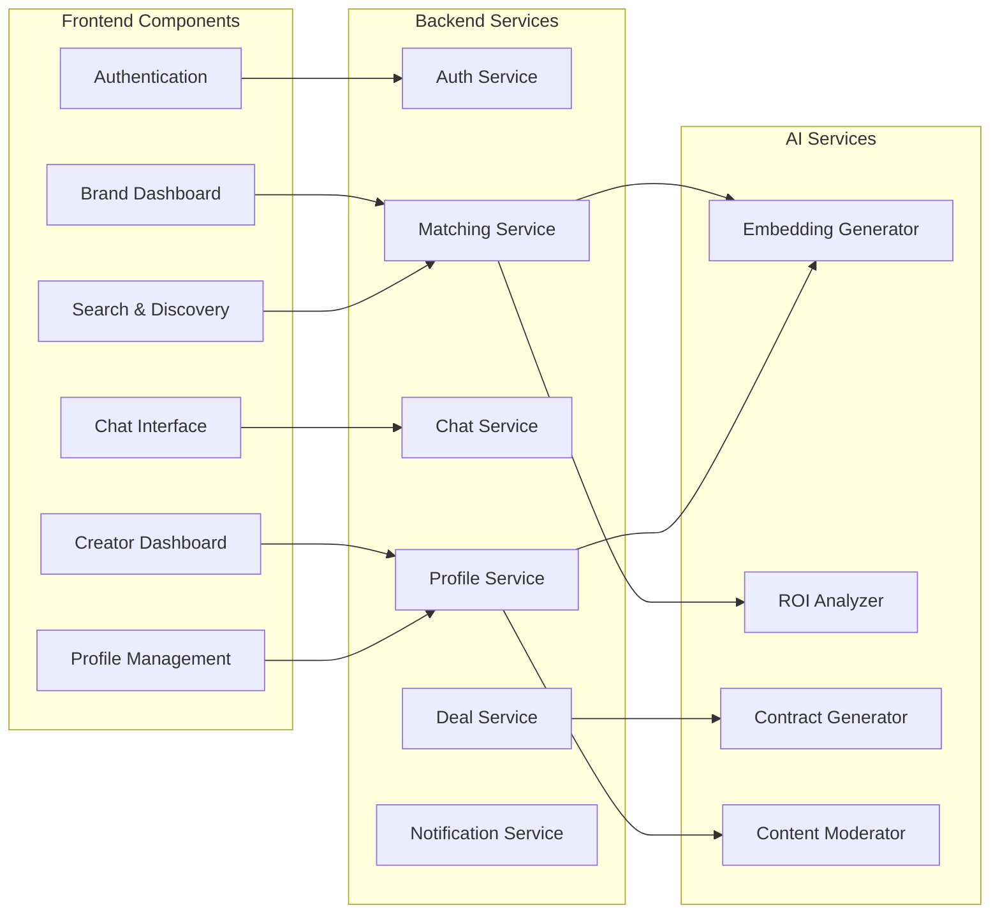
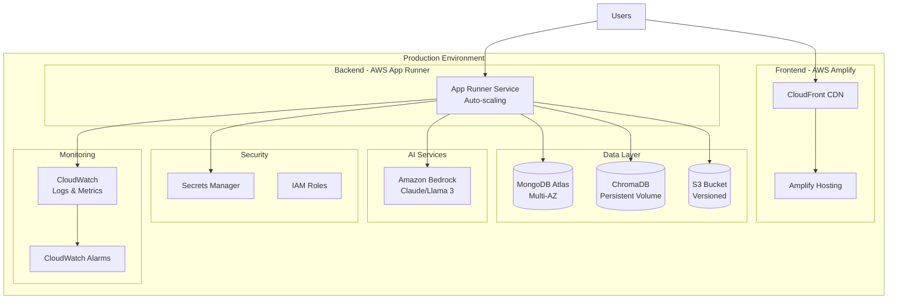
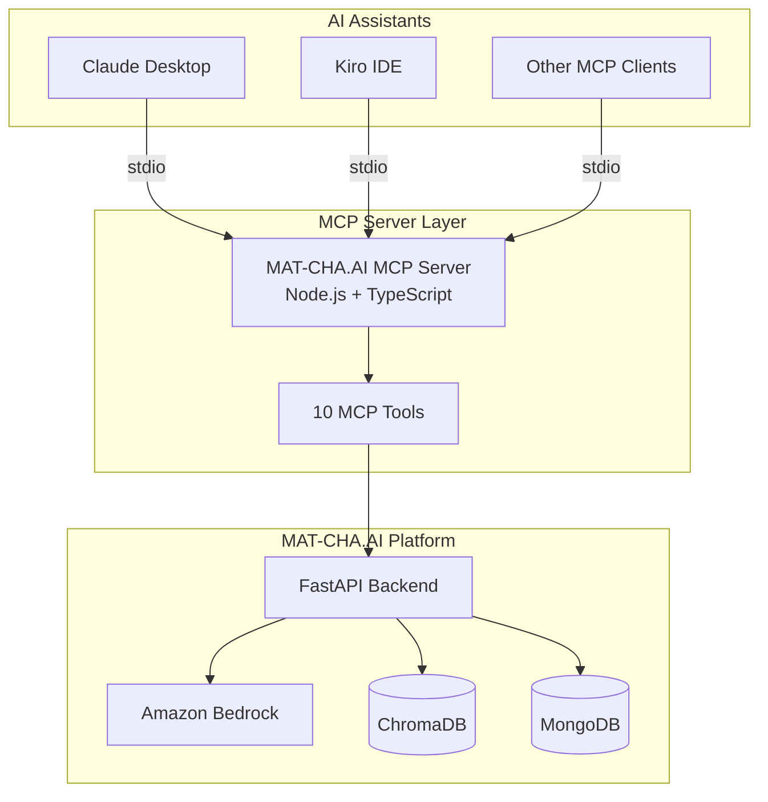
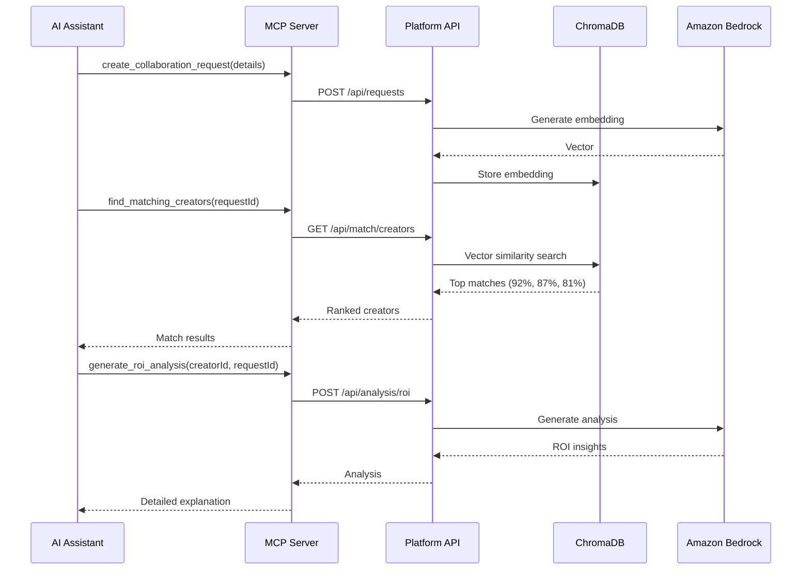
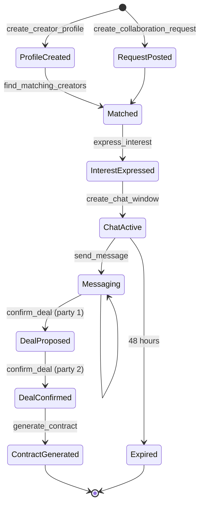
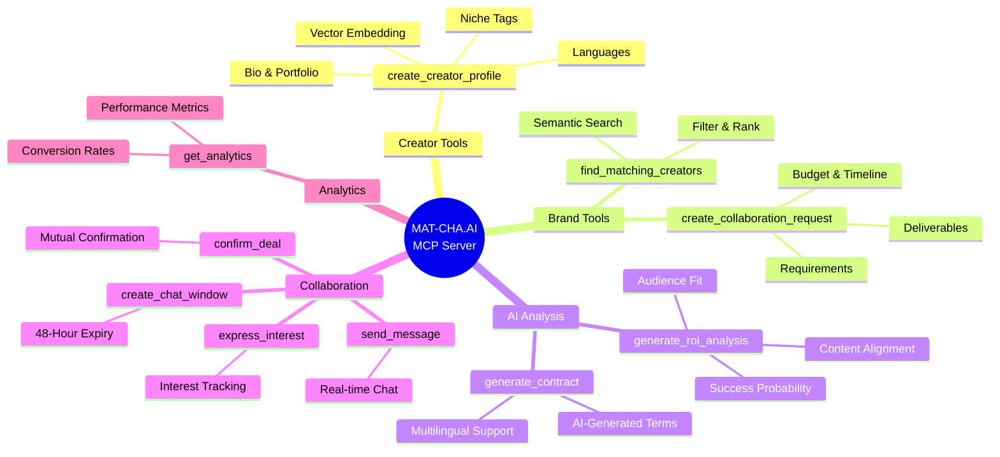

# Design Document: MAT-CHA.AI Platform

## Overview

MAT-CHA.AI is a full-stack AI-powered matchmaking platform that connects Indian startups and content creators through semantic similarity matching, automated ROI analysis, and structured collaboration workflows. The platform leverages vector embeddings for "vibe matching," time-bound communication channels to accelerate decision-making, and AI-assisted content generation to reduce friction in creator-brand partnerships.

The system architecture follows a modern cloud-native approach using AWS services, with a React frontend, FastAPI backend, MongoDB for persistence, ChromaDB for vector storage, and Amazon Bedrock for AI capabilities.

### Key Design Principles

1. **Semantic-First Matching**: Move beyond keyword matching to understand content essence through vector embeddings
2. **Time-Bounded Interactions**: Use ephemeral 48-hour chat windows to create urgency and reduce ghosting
3. **AI-Augmented Decisions**: Provide explainable AI insights to help users make informed choices
4. **Scalable Cloud Architecture**: Leverage AWS managed services for automatic scaling and reliability
5. **Regional Inclusivity**: Support multilingual content and regional language interfaces
6. **Trust Through Structure**: Implement mutual confirmation mechanisms to professionalize collaborations

## Architecture

### High-Level Architecture



### Component Architecture



## Components and Interfaces

### 1. Authentication Service

**Responsibility**: Manage user registration, authentication, and role-based access control.

**Interface**:
```python
class AuthService:
    def register_user(email: str, password: str, role: UserRole) -> User:
        """Register new user with role (Brand or Creator)"""
        
    def authenticate(email: str, password: str) -> AuthToken:
        """Authenticate user and return JWT token"""
        
    def verify_token(token: str) -> User:
        """Verify JWT token and return user"""
        
    def lock_account(user_id: str, duration_minutes: int) -> None:
        """Temporarily lock account after failed attempts"""
        
    def get_user_permissions(user_id: str) -> List[Permission]:
        """Get role-based permissions for user"""
```

**Dependencies**: AWS IAM, AWS Secrets Manager, MongoDB Atlas

**Key Behaviors**:
- Hash passwords using bcrypt before storage
- Generate JWT tokens with 24-hour expiration
- Track failed login attempts per user
- Implement automatic account locking after 3 failed attempts
- Store credentials in AWS Secrets Manager

### 2. Profile Service

**Responsibility**: Manage Creator profiles, portfolio content, and profile indexing.

**Interface**:
```python
class ProfileService:
    def create_profile(user_id: str, profile_data: ProfileData) -> Profile:
        """Create new Creator profile"""
        
    def update_profile(profile_id: str, updates: ProfileData) -> Profile:
        """Update existing profile and trigger re-indexing"""
        
    def upload_portfolio_item(profile_id: str, content: PortfolioItem) -> str:
        """Upload portfolio content to S3 and generate embeddings"""
        
    def get_profile(profile_id: str) -> Profile:
        """Retrieve profile by ID"""
        
    def validate_profile_completeness(profile: Profile) -> ValidationResult:
        """Check if profile meets minimum requirements"""
```

**Dependencies**: Amazon S3, Amazon Bedrock, ChromaDB, Content Moderation Service

**Key Behaviors**:
- Upload assets to S3 with unique keys
- Generate embeddings for text content using Bedrock
- Store embeddings in ChromaDB with profile metadata
- Trigger re-indexing on profile updates
- Validate minimum profile requirements (bio, niche, 3 samples)

### 3. Embedding Generator

**Responsibility**: Generate vector embeddings for Creator profiles and Collaboration Requests.

**Interface**:
```python
class EmbeddingGenerator:
    def generate_profile_embedding(profile: Profile) -> Vector:
        """Generate embedding from Creator profile content"""
        
    def generate_request_embedding(request: CollaborationRequest) -> Vector:
        """Generate embedding from Collaboration Request"""
        
    def generate_text_embedding(text: str, language: str) -> Vector:
        """Generate embedding from arbitrary text with language support"""
        
    def batch_generate_embeddings(texts: List[str]) -> List[Vector]:
        """Generate embeddings for multiple texts efficiently"""
```

**Dependencies**: Amazon Bedrock (Claude/Llama 3 embedding models)

**Key Behaviors**:
- Use Amazon Bedrock's embedding API
- Support multilingual embeddings for regional languages
- Normalize vectors to unit length for cosine similarity
- Batch process embeddings for efficiency
- Cache embeddings for 24 hours

### 4. Matching Service

**Responsibility**: Perform semantic matching between Creators and Collaboration Requests.

**Interface**:
```python
class MatchingService:
    def find_creators_for_request(request_id: str, min_score: float) -> List[Match]:
        """Find Creators matching a Collaboration Request"""
        
    def find_requests_for_creator(creator_id: str) -> List[Match]:
        """Find Collaboration Requests matching a Creator"""
        
    def calculate_match_score(creator_embedding: Vector, request_embedding: Vector) -> float:
        """Calculate similarity score between embeddings"""
        
    def rank_matches(matches: List[Match]) -> List[Match]:
        """Sort matches by score descending"""
        
    def apply_filters(matches: List[Match], filters: SearchFilters) -> List[Match]:
        """Apply additional filtering criteria"""
```

**Dependencies**: ChromaDB, Embedding Generator, ROI Analyzer

**Key Behaviors**:
- Query ChromaDB for vector similarity search
- Calculate cosine similarity between embeddings
- Return scores as percentages (0-100)
- Support minimum threshold filtering
- Combine semantic matching with traditional filters

### 5. ROI Analyzer

**Responsibility**: Generate AI-powered explanations for Creator-Brand matches.

**Interface**:
```python
class ROIAnalyzer:
    def generate_roi_analysis(creator: Profile, request: CollaborationRequest, match_score: float) -> ROIAnalysis:
        """Generate comprehensive ROI analysis for a match"""
        
    def explain_match_factors(creator: Profile, request: CollaborationRequest) -> List[MatchFactor]:
        """Break down specific factors contributing to match"""
        
    def estimate_reach(creator: Profile) -> ReachEstimate:
        """Estimate potential audience reach"""
        
    def calculate_success_probability(creator: Profile, request: CollaborationRequest) -> float:
        """Predict collaboration success probability"""
```

**Dependencies**: Amazon Bedrock, MongoDB Atlas

**Key Behaviors**:
- Use Bedrock LLM to generate natural language explanations
- Analyze content alignment, audience fit, and engagement metrics
- Cache analyses for 24 hours
- Invalidate cache on profile updates
- Structure output with clear sections (alignment, demographics, reach, probability)

### 6. Collaboration Request Service

**Responsibility**: Manage Brand collaboration requests and their lifecycle.

**Interface**:
```python
class CollaborationRequestService:
    def create_request(brand_id: str, request_data: RequestData) -> CollaborationRequest:
        """Create new Collaboration Request"""
        
    def update_request(request_id: str, updates: RequestData) -> CollaborationRequest:
        """Update existing request"""
        
    def set_request_status(request_id: str, status: RequestStatus) -> None:
        """Change request status (active/paused/closed)"""
        
    def get_request(request_id: str) -> CollaborationRequest:
        """Retrieve request by ID"""
        
    def validate_request(request_data: RequestData) -> ValidationResult:
        """Validate request has required fields"""
```

**Dependencies**: MongoDB Atlas, Embedding Generator, Content Moderation Service

**Key Behaviors**:
- Validate required fields (title, description, budget, timeline, deliverables)
- Generate embeddings on creation
- Index in MongoDB for searchability within 2 minutes
- Support status transitions
- Trigger moderation on creation

### 7. Interest Expression Service

**Responsibility**: Handle Creator interest expressions and Brand responses.

**Interface**:
```python
class InterestService:
    def express_interest(creator_id: str, request_id: str) -> Interest:
        """Creator expresses interest in a request"""
        
    def accept_interest(brand_id: str, interest_id: str) -> ChatWindow:
        """Brand accepts interest and creates chat window"""
        
    def reject_interest(brand_id: str, interest_id: str) -> None:
        """Brand rejects interest"""
        
    def get_interests_for_request(request_id: str) -> List[Interest]:
        """Get all interests for a request"""
        
    def check_duplicate_interest(creator_id: str, request_id: str) -> bool:
        """Check if Creator already expressed interest"""
```

**Dependencies**: MongoDB Atlas, Notification Service, Chat Service

**Key Behaviors**:
- Prevent duplicate interest expressions
- Notify Brand within 1 minute of interest
- Create chat window on acceptance
- Track interest status (pending/accepted/rejected)

### 8. Chat Service

**Responsibility**: Manage ephemeral 48-hour chat windows between Brands and Creators.

**Interface**:
```python
class ChatService:
    def create_chat_window(brand_id: str, creator_id: str, request_id: str) -> ChatWindow:
        """Create new 48-hour chat window"""
        
    def send_message(chat_id: str, sender_id: str, content: str) -> Message:
        """Send message in chat window"""
        
    def get_messages(chat_id: str) -> List[Message]:
        """Retrieve all messages in chat"""
        
    def get_remaining_time(chat_id: str) -> timedelta:
        """Get remaining time before expiration"""
        
    def close_chat_window(chat_id: str, reason: CloseReason) -> None:
        """Close and archive chat window"""
        
    def check_expired_windows() -> List[ChatWindow]:
        """Background job to close expired windows"""
```

**Dependencies**: MongoDB Atlas, Notification Service

**Key Behaviors**:
- Set 48-hour expiration on creation
- Deliver messages within 2 seconds
- Display countdown timer
- Send reminder at 6 hours remaining
- Auto-close on expiration
- Archive messages after closure
- Run background job every 5 minutes to check expirations

### 9. Deal Service

**Responsibility**: Manage deal confirmation and contract generation.

**Interface**:
```python
class DealService:
    def propose_deal(chat_id: str, deal_terms: DealTerms) -> Deal:
        """Propose deal within chat window"""
        
    def confirm_deal(deal_id: str, user_id: str) -> Deal:
        """User confirms their side of the deal"""
        
    def get_deal_status(deal_id: str) -> DealStatus:
        """Check if deal is pending/confirmed/expired"""
        
    def generate_contract(deal_id: str) -> Contract:
        """Generate AI-assisted contract for confirmed deal"""
        
    def update_payment_status(deal_id: str, status: PaymentStatus) -> None:
        """Update payment milestone status"""
```

**Dependencies**: MongoDB Atlas, Contract Generator, Amazon S3

**Key Behaviors**:
- Require mutual confirmation from both parties
- Track confirmation status per party
- Mark as "pending" if only one party confirms
- Create deal record on mutual confirmation
- Close chat window after confirmation
- Store contracts in S3 with encryption

### 10. Contract Generator

**Responsibility**: Generate AI-assisted contracts and collaboration scripts.

**Interface**:
```python
class ContractGenerator:
    def generate_contract(deal: Deal, brand: User, creator: Profile) -> Contract:
        """Generate contract from deal parameters"""
        
    def generate_script(deal: Deal, brand_guidelines: str, creator_style: str) -> Script:
        """Generate collaboration script"""
        
    def customize_contract(contract: Contract, modifications: List[str]) -> Contract:
        """Apply user-requested modifications"""
        
    def validate_contract_completeness(contract: Contract) -> ValidationResult:
        """Ensure contract has all required sections"""
```

**Dependencies**: Amazon Bedrock, Amazon S3

**Key Behaviors**:
- Use Bedrock LLM to generate contract templates
- Include sections: deliverables, timeline, payment, usage rights
- Support iterative modifications
- Generate scripts incorporating brand messaging and creator style
- Store finalized contracts in S3 with encryption

### 11. Notification Service

**Responsibility**: Send notifications through multiple channels.

**Interface**:
```python
class NotificationService:
    def send_notification(user_id: str, event: NotificationEvent) -> None:
        """Send notification for an event"""
        
    def send_in_app_notification(user_id: str, message: str) -> None:
        """Send in-app notification"""
        
    def send_email_notification(user_id: str, subject: str, body: str) -> None:
        """Send email notification"""
        
    def get_user_preferences(user_id: str) -> NotificationPreferences:
        """Get user's notification preferences"""
        
    def update_preferences(user_id: str, preferences: NotificationPreferences) -> None:
        """Update notification preferences"""
```

**Dependencies**: AWS SES (for email), MongoDB Atlas

**Key Behaviors**:
- Send notifications within 1 minute of events
- Support in-app and email channels
- Respect user preferences per event type
- Send reminders for time-sensitive actions
- Queue notifications for batch processing

### 12. Content Moderation Service

**Responsibility**: Automatically moderate user-generated content.

**Interface**:
```python
class ContentModerationService:
    def moderate_profile_content(content: PortfolioItem) -> ModerationResult:
        """Check portfolio content for policy violations"""
        
    def moderate_collaboration_request(request: CollaborationRequest) -> ModerationResult:
        """Check request against community guidelines"""
        
    def flag_for_review(content_id: str, reason: str) -> None:
        """Flag content for manual review"""
        
    def get_moderation_queue() -> List[FlaggedContent]:
        """Get queue of flagged content"""
```

**Dependencies**: Amazon Bedrock, MongoDB Atlas

**Key Behaviors**:
- Scan content using Bedrock's moderation capabilities
- Flag inappropriate content before publication
- Maintain moderation queue for administrators
- Auto-suspend accounts with multiple violations
- Log all moderation decisions

### 13. Search Service

**Responsibility**: Provide comprehensive search and filtering capabilities.

**Interface**:
```python
class SearchService:
    def search_creators(query: SearchQuery) -> List[Profile]:
        """Search Creators with filters"""
        
    def search_requests(query: SearchQuery) -> List[CollaborationRequest]:
        """Search Collaboration Requests with filters"""
        
    def save_search(user_id: str, query: SearchQuery) -> SavedSearch:
        """Save search for future use"""
        
    def get_saved_searches(user_id: str) -> List[SavedSearch]:
        """Retrieve user's saved searches"""
```

**Dependencies**: MongoDB Atlas, ChromaDB, Matching Service

**Key Behaviors**:
- Combine semantic and traditional search
- Support filters: niche, location, budget, timeline
- Return results within 3 seconds
- Allow saving searches
- Rank results by relevance

### 14. Analytics Service

**Responsibility**: Track and report platform metrics and user analytics.

**Interface**:
```python
class AnalyticsService:
    def track_event(user_id: str, event: AnalyticsEvent) -> None:
        """Track user event"""
        
    def get_brand_analytics(brand_id: str) -> BrandAnalytics:
        """Get analytics for Brand's requests"""
        
    def get_creator_analytics(creator_id: str) -> CreatorAnalytics:
        """Get analytics for Creator's profile"""
        
    def generate_platform_metrics() -> PlatformMetrics:
        """Generate overall platform metrics"""
        
    def export_analytics(user_id: str, format: ExportFormat) -> File:
        """Export analytics data"""
```

**Dependencies**: MongoDB Atlas, AWS CloudWatch

**Key Behaviors**:
- Track views, interests, conversions
- Update dashboards in real-time
- Generate visualizations
- Support CSV export
- Calculate success rates and engagement metrics

## Data Models

### User
```python
class User:
    id: str
    email: str
    password_hash: str
    role: UserRole  # Brand or Creator
    created_at: datetime
    last_login: datetime
    failed_login_attempts: int
    account_locked_until: Optional[datetime]
    language_preference: str
    notification_preferences: NotificationPreferences
```

### Profile (Creator)
```python
class Profile:
    id: str
    user_id: str
    bio: str
    niche_tags: List[str]
    location: str
    languages: List[str]
    portfolio_items: List[PortfolioItem]
    social_links: Dict[str, str]
    follower_count: int
    engagement_rate: float
    embedding_id: str  # Reference to ChromaDB
    created_at: datetime
    updated_at: datetime
```

### PortfolioItem
```python
class PortfolioItem:
    id: str
    profile_id: str
    content_type: str  # text, image, video_link
    content_url: str  # S3 URL
    description: str
    created_at: datetime
    moderation_status: ModerationStatus
```

### CollaborationRequest
```python
class CollaborationRequest:
    id: str
    brand_id: str
    title: str
    description: str
    budget_min: float
    budget_max: float
    timeline: str
    deliverables: List[str]
    niche_tags: List[str]
    status: RequestStatus  # active, paused, closed
    embedding_id: str  # Reference to ChromaDB
    created_at: datetime
    updated_at: datetime
```

### Interest
```python
class Interest:
    id: str
    creator_id: str
    request_id: str
    status: InterestStatus  # pending, accepted, rejected
    created_at: datetime
    responded_at: Optional[datetime]
```

### ChatWindow
```python
class ChatWindow:
    id: str
    brand_id: str
    creator_id: str
    request_id: str
    created_at: datetime
    expires_at: datetime
    status: ChatStatus  # active, closed
    close_reason: Optional[CloseReason]
    messages: List[Message]
```

### Message
```python
class Message:
    id: str
    chat_id: str
    sender_id: str
    content: str
    sent_at: datetime
    delivered_at: Optional[datetime]
```

### Deal
```python
class Deal:
    id: str
    chat_id: str
    brand_id: str
    creator_id: str
    request_id: str
    terms: DealTerms
    brand_confirmed: bool
    creator_confirmed: bool
    status: DealStatus  # pending, confirmed, expired
    contract_url: Optional[str]  # S3 URL
    payment_status: PaymentStatus
    created_at: datetime
    confirmed_at: Optional[datetime]
```

### DealTerms
```python
class DealTerms:
    deliverables: List[str]
    timeline: str
    payment_amount: float
    payment_milestones: List[PaymentMilestone]
    usage_rights: str
    additional_terms: str
```

### Match
```python
class Match:
    creator_id: str
    request_id: str
    match_score: float  # 0-100
    roi_analysis: Optional[ROIAnalysis]
    created_at: datetime
```

### ROIAnalysis
```python
class ROIAnalysis:
    match_id: str
    content_alignment: str
    audience_fit: str
    estimated_reach: int
    success_probability: float
    key_factors: List[str]
    generated_at: datetime
    expires_at: datetime
```

### Vector Embedding (ChromaDB)
```python
class VectorEmbedding:
    id: str
    vector: List[float]  # Embedding vector
    metadata: Dict[str, Any]  # Profile or Request metadata
    entity_type: str  # "profile" or "request"
    entity_id: str
    created_at: datetime
```

## Correctness Properties

*A property is a characteristic or behavior that should hold true across all valid executions of a system—essentially, a formal statement about what the system should do. Properties serve as the bridge between human-readable specifications and machine-verifiable correctness guarantees.*


### Property Reflection

After analyzing all acceptance criteria, I've identified several areas of redundancy:

1. **Embedding Generation (2.1, 3.1)**: Both Creator profiles and Collaboration Requests generate embeddings. These can be combined into one property about embedding generation for any content.

2. **Ranking by Match Score (4.3, 6.1)**: Both Brand searches for Creators and Creator searches for Requests use the same ranking logic. One property covers both.

3. **Storage and Retrieval (2.2, 3.4, 8.5, 9.5, 16.4)**: Multiple criteria about storing and retrieving data. These can be combined into properties about persistence round-trips.

4. **Notification Sending (11.1, 16.3)**: Multiple criteria about sending notifications. One property about notification delivery covers all cases.

5. **Analytics Tracking (18.1, 18.2)**: Both Brand and Creator analytics follow the same pattern. One property about event tracking covers both.

6. **Validation (2.6, 3.2)**: Profile and Request validation follow similar patterns. Can be combined into properties about validation rules.

7. **Match Score Properties (4.1, 4.2)**: Computing match scores and comparing embeddings are the same operation. 4.2 is implementation detail of 4.1.

8. **Content Moderation (17.1, 17.3)**: Scanning portfolio content and requests use the same moderation logic.

After reflection, I'll focus on unique, high-value properties that provide comprehensive coverage without redundancy.

### Correctness Properties

**Property 1: User Registration Role Assignment**
*For any* user registration with valid credentials and role designation, creating an account should result in a user record with the specified role (Brand or Creator) that can be retrieved.
**Validates: Requirements 1.1**

**Property 2: Role-Based Access Control**
*For any* authenticated user, the permissions granted should match exactly the permissions defined for their role, with Brand users unable to access Creator-only features and vice versa.
**Validates: Requirements 1.3, 12.4**

**Property 3: Embedding Generation for Content**
*For any* text content (Creator profile or Collaboration Request), generating embeddings should produce a vector that can be stored and retrieved from the Vector Store.
**Validates: Requirements 2.1, 2.2, 3.1**

**Property 4: Portfolio Content Type Support**
*For any* portfolio item of type text, image, or video_link, the upload process should successfully store the content and return a valid URL.
**Validates: Requirements 2.4, 2.5**

**Property 5: Profile Validation**
*For any* Creator profile, validation should reject profiles missing required fields (bio, niche tags, or fewer than 3 portfolio samples) and accept profiles with all required fields.
**Validates: Requirements 2.6**

**Property 6: Collaboration Request Validation**
*For any* Collaboration Request, validation should reject requests missing required fields (title, description, budget range, timeline, deliverables) and accept complete requests.
**Validates: Requirements 3.2**

**Property 7: Request Status Transitions**
*For any* Collaboration Request, setting the status to active, paused, or closed should result in the request having that status when retrieved.
**Validates: Requirements 3.5**

**Property 8: Match Score Calculation**
*For any* Creator profile embedding and Collaboration Request embedding, the computed match score should be a value between 0 and 100, with higher scores indicating greater semantic similarity.
**Validates: Requirements 4.1, 4.4**

**Property 9: Match Result Ranking**
*For any* list of Creator matches, the results should be ordered by match score in descending order, with the highest scoring Creator appearing first.
**Validates: Requirements 4.3, 6.1**

**Property 10: Match Score Filtering**
*For any* search with a minimum match score threshold, all returned results should have match scores greater than or equal to the threshold.
**Validates: Requirements 4.5**

**Property 11: ROI Analysis Structure**
*For any* generated ROI Analysis, it should contain all required sections: content alignment factors, audience demographics fit, estimated reach, and collaboration success probability.
**Validates: Requirements 5.2**

**Property 12: ROI Analysis Caching**
*For any* Creator-Request match, generating an ROI Analysis twice within 24 hours should return the same cached result on the second request.
**Validates: Requirements 5.4**

**Property 13: Cache Invalidation on Profile Update**
*For any* Creator profile with cached ROI Analyses, updating the profile should invalidate all associated caches, causing subsequent requests to generate fresh analyses.
**Validates: Requirements 5.5**

**Property 14: Search Filtering**
*For any* Creator search with filters (niche, location, budget, timeline), all returned results should satisfy all specified filter criteria.
**Validates: Requirements 6.3, 10.1**

**Property 15: Duplicate Interest Prevention**
*For any* Creator and Collaboration Request pair, attempting to express interest twice should succeed the first time and be rejected the second time.
**Validates: Requirements 6.5**

**Property 16: Chat Window Creation with Expiration**
*For any* accepted interest, creating a chat window should result in a window with an expiration time exactly 48 hours from creation.
**Validates: Requirements 7.1**

**Property 17: Message Exchange in Active Windows**
*For any* active chat window, sending a message from either party should result in the message being stored and retrievable in the chat history.
**Validates: Requirements 7.3**

**Property 18: Chat Window Expiration**
*For any* chat window where 48 hours have elapsed since creation, the window status should be "closed" and no new messages should be accepted.
**Validates: Requirements 7.4**

**Property 19: Opportunity Status on Expiration**
*For any* chat window that expires without a confirmed deal, the associated opportunity status should be marked as "declined".
**Validates: Requirements 7.5**

**Property 20: Mutual Deal Confirmation**
*For any* proposed deal, the deal status should only become "confirmed" when both the Brand and Creator have explicitly confirmed, remaining "pending" if only one party confirms.
**Validates: Requirements 8.2, 8.3**

**Property 21: Deal Persistence Round-Trip**
*For any* confirmed deal with terms, storing the deal should allow retrieval of an equivalent deal record with the same terms, party identifiers, and timestamps.
**Validates: Requirements 8.5**

**Property 22: Chat Closure on Deal Confirmation**
*For any* chat window with a confirmed deal, the chat window status should transition to "closed" and the deal should transition to contract generation phase.
**Validates: Requirements 8.6**

**Property 23: Contract Structure Completeness**
*For any* generated contract, it should contain all required sections: deliverables, timeline, payment terms, and usage rights.
**Validates: Requirements 9.3**

**Property 24: Contract Storage Round-Trip**
*For any* finalized contract, storing it in S3 should allow retrieval of the same contract content by its URL.
**Validates: Requirements 9.5**

**Property 25: Script Generation with Context**
*For any* deal with brand messaging guidelines and creator style inputs, the generated script should contain references to or incorporate elements from both inputs.
**Validates: Requirements 9.6**

**Property 26: Semantic and Traditional Search Combination**
*For any* search combining semantic matching with traditional filters, results should satisfy both the minimum match score threshold and all specified filter criteria.
**Validates: Requirements 10.3**

**Property 27: Saved Search Round-Trip**
*For any* search query saved by a user, retrieving saved searches should return a query equivalent to the original with the same parameters.
**Validates: Requirements 10.5**

**Property 28: Notification Delivery**
*For any* platform event that triggers notifications, the notification service should create notification records for all affected users with the correct event type.
**Validates: Requirements 11.1**

**Property 29: Notification Preference Respect**
*For any* user with notification preferences configured, notifications should only be sent through channels enabled for that event type in the user's preferences.
**Validates: Requirements 11.6**

**Property 30: Sensitive Data Access Logging**
*For any* access to sensitive data (credentials, payment info, personal data), an audit log entry should be created in CloudWatch with user ID, timestamp, and resource accessed.
**Validates: Requirements 12.6**

**Property 31: Slow Query Logging**
*For any* database query that exceeds 100ms execution time, a log entry should be created in CloudWatch with the query details and execution time.
**Validates: Requirements 13.5**

**Property 32: API Request Logging**
*For any* API request to the platform, a log entry should be created in CloudWatch containing the request method, path, user ID, and response status.
**Validates: Requirements 14.1**

**Property 33: Error Context Capture**
*For any* error that occurs during request processing, the error log should contain the stack trace, request context, and user information.
**Validates: Requirements 14.2**

**Property 34: Metrics Tracking**
*For any* platform event (match created, chat started, deal confirmed), the corresponding metric counter should be incremented in the analytics system.
**Validates: Requirements 14.3**

**Property 35: Language UI Consistency**
*For any* user with a selected language preference, all UI elements should be displayed in that language with no mixed-language content.
**Validates: Requirements 15.2**

**Property 36: Multilingual AI Content Generation**
*For any* AI-generated content (ROI analysis, contract, script) requested in a specific language, the output should be in the requested language.
**Validates: Requirements 15.3**

**Property 37: Regional Language Profile Indexing**
*For any* Creator profile written in a regional language (Hindi, Tamil, Telugu, Bengali, Marathi), embeddings should be generated and the profile should be searchable.
**Validates: Requirements 15.4**

**Property 38: Cross-Language Matching**
*For any* Creator profile in one language and Collaboration Request in another language, the matching algorithm should compute a valid match score using multilingual embeddings.
**Validates: Requirements 15.5**

**Property 39: Payment Milestone Tracking**
*For any* confirmed deal with payment milestones, recording a milestone should allow retrieval of the milestone with its status (pending, completed, disputed).
**Validates: Requirements 16.1, 16.2**

**Property 40: Payment Status Change Notifications**
*For any* payment status change on a deal, both the Brand and Creator should receive notifications about the status update.
**Validates: Requirements 16.3**

**Property 41: Payment History Report Accuracy**
*For any* user (Brand or Creator) with payment records, the generated payment history report should contain all payment transactions associated with that user.
**Validates: Requirements 16.5**

**Property 42: Content Moderation Scanning**
*For any* uploaded portfolio content or posted Collaboration Request, the content should be scanned by the moderation service before being made publicly visible.
**Validates: Requirements 17.1, 17.3**

**Property 43: Inappropriate Content Blocking**
*For any* content flagged as inappropriate by the moderation service, the content should not be published and should appear in the moderation queue.
**Validates: Requirements 17.2**

**Property 44: Moderation Queue Management**
*For any* content flagged for review, it should appear in the moderation queue accessible to administrators with the flagging reason.
**Validates: Requirements 17.4**

**Property 45: Automatic Account Suspension**
*For any* user account with content flagged multiple times (threshold: 3 flags), the account should be automatically suspended with status "pending_review".
**Validates: Requirements 17.5**

**Property 46: Analytics Event Tracking**
*For any* user action (profile view, interest expression, deal confirmation), the corresponding analytics event should be recorded with user ID, timestamp, and action type.
**Validates: Requirements 18.1, 18.2**

**Property 47: Analytics Data Export**
*For any* user's analytics data, exporting to CSV format should produce a file containing all tracked events and metrics for that user.
**Validates: Requirements 18.4**

## Error Handling

### Error Categories

1. **Validation Errors**: Invalid input data, missing required fields, constraint violations
2. **Authentication Errors**: Invalid credentials, expired tokens, insufficient permissions
3. **Resource Not Found**: Requested entity doesn't exist
4. **Conflict Errors**: Duplicate resources, invalid state transitions
5. **External Service Errors**: AWS service failures, database connection issues
6. **Rate Limiting**: Too many requests from a user
7. **Content Moderation**: Inappropriate content detected

### Error Response Format

All API errors should follow a consistent format:

```python
class ErrorResponse:
    error_code: str  # Machine-readable error code
    message: str  # Human-readable error message
    details: Optional[Dict[str, Any]]  # Additional context
    timestamp: datetime
    request_id: str  # For tracing
```

### Error Handling Strategies

**Validation Errors**:
- Return 400 Bad Request with specific field errors
- Include which fields failed validation and why
- Example: "Profile validation failed: bio is required, minimum 3 portfolio items required"

**Authentication Errors**:
- Return 401 Unauthorized for invalid credentials
- Return 403 Forbidden for insufficient permissions
- Lock account after 3 failed attempts for 15 minutes
- Log all authentication failures for security monitoring

**Resource Not Found**:
- Return 404 Not Found with resource type and ID
- Example: "Collaboration Request with ID 'abc123' not found"

**Conflict Errors**:
- Return 409 Conflict for duplicate resources
- Example: "Interest already expressed for this Collaboration Request"
- Include existing resource ID in error details

**External Service Errors**:
- Implement exponential backoff retry for transient failures
- Return 503 Service Unavailable for AWS service outages
- Log all external service errors with full context
- Fallback to cached data when possible (e.g., ROI analyses)

**Rate Limiting**:
- Implement per-user rate limits: 100 requests per minute
- Return 429 Too Many Requests with retry-after header
- Use token bucket algorithm for rate limiting

**Content Moderation**:
- Return 422 Unprocessable Entity for flagged content
- Include moderation reason in error details
- Queue content for manual review
- Notify user of moderation decision

### Retry Logic

**Idempotent Operations** (GET, PUT, DELETE):
- Retry up to 3 times with exponential backoff
- Initial delay: 100ms, max delay: 5 seconds

**Non-Idempotent Operations** (POST):
- Use idempotency keys for safe retries
- Store idempotency keys for 24 hours
- Return cached response for duplicate requests

### Circuit Breaker Pattern

Implement circuit breakers for external services:
- **Closed**: Normal operation, requests pass through
- **Open**: After 5 consecutive failures, reject requests immediately for 30 seconds
- **Half-Open**: After timeout, allow 1 test request to check if service recovered

Apply to:
- Amazon Bedrock API calls
- MongoDB Atlas connections
- ChromaDB queries
- S3 operations

### Graceful Degradation

When non-critical services fail:
- **ROI Analysis unavailable**: Show matches without explanations
- **Notification service down**: Queue notifications for later delivery
- **Analytics service down**: Continue core operations, log events for batch processing
- **Content moderation slow**: Allow content with delayed moderation review

### Error Monitoring

- Log all errors to AWS CloudWatch with full context
- Set up CloudWatch alarms for error rate thresholds
- Track error rates by type and endpoint
- Create dashboards for error trends
- Alert on-call engineers for critical errors (auth failures, data corruption)

## Testing Strategy

### Dual Testing Approach

The MAT-CHA.AI platform requires both unit testing and property-based testing for comprehensive coverage:

**Unit Tests**: Focus on specific examples, edge cases, and integration points
- Authentication flows with valid/invalid credentials
- Account locking after 3 failed attempts
- Empty search results handling
- Chat window expiration edge cases
- Single-party deal confirmation scenarios
- Content moderation for specific inappropriate content
- Payment status transitions
- Error handling for specific failure scenarios

**Property-Based Tests**: Verify universal properties across all inputs
- All 47 correctness properties defined above
- Each property test should run minimum 100 iterations
- Use randomized inputs to discover edge cases
- Test invariants that must hold for all valid data

### Property-Based Testing Configuration

**Testing Library**: Use **Hypothesis** for Python (FastAPI backend)

**Test Configuration**:
```python
from hypothesis import given, settings
import hypothesis.strategies as st

@settings(max_examples=100)  # Minimum 100 iterations
@given(
    email=st.emails(),
    password=st.text(min_size=8),
    role=st.sampled_from(['Brand', 'Creator'])
)
def test_property_1_user_registration_role_assignment(email, password, role):
    """
    Feature: mat-cha-ai-platform, Property 1: User Registration Role Assignment
    For any user registration with valid credentials and role designation,
    creating an account should result in a user record with the specified role.
    """
    # Test implementation
```

**Tag Format**: Each property test must include a comment with:
```python
"""
Feature: mat-cha-ai-platform, Property {number}: {property title}
{property statement}
"""
```

### Test Organization

```
tests/
├── unit/
│   ├── test_auth_service.py
│   ├── test_profile_service.py
│   ├── test_matching_service.py
│   ├── test_chat_service.py
│   ├── test_deal_service.py
│   └── ...
├── property/
│   ├── test_properties_auth.py  # Properties 1-2
│   ├── test_properties_profiles.py  # Properties 3-6
│   ├── test_properties_matching.py  # Properties 7-14
│   ├── test_properties_collaboration.py  # Properties 15-22
│   ├── test_properties_contracts.py  # Properties 23-27
│   ├── test_properties_notifications.py  # Properties 28-29
│   ├── test_properties_security.py  # Properties 30-34
│   ├── test_properties_i18n.py  # Properties 35-38
│   ├── test_properties_payments.py  # Properties 39-41
│   ├── test_properties_moderation.py  # Properties 42-45
│   └── test_properties_analytics.py  # Properties 46-47
└── integration/
    ├── test_end_to_end_collaboration_flow.py
    ├── test_aws_integrations.py
    └── test_database_operations.py
```

### Testing Priorities

**Critical Path Tests** (Must have 100% coverage):
1. Authentication and authorization
2. Embedding generation and matching
3. Chat window lifecycle
4. Deal confirmation and contract generation
5. Payment tracking
6. Content moderation

**High Priority Tests** (Target 90% coverage):
1. Profile management
2. Search and filtering
3. Notification delivery
4. Analytics tracking
5. Error handling

**Medium Priority Tests** (Target 70% coverage):
1. UI localization
2. Caching behavior
3. Logging and monitoring
4. Performance optimizations

### Mock Strategy

**Mock External Services**:
- Amazon Bedrock: Mock embedding and LLM responses
- AWS S3: Use in-memory storage or localstack
- MongoDB Atlas: Use test database or in-memory MongoDB
- ChromaDB: Use in-memory instance
- AWS Secrets Manager: Mock credential retrieval

**Integration Tests**: Use real services in staging environment
- Test actual AWS service integrations
- Verify end-to-end flows with real data
- Run before production deployments

### Continuous Integration

**Pre-commit Hooks**:
- Run unit tests
- Run linting (flake8, black)
- Type checking (mypy)

**CI Pipeline** (GitHub Actions / AWS CodePipeline):
1. Run all unit tests
2. Run all property-based tests (100 iterations each)
3. Run integration tests against staging
4. Generate coverage reports (target: 85% overall)
5. Deploy to staging on main branch
6. Manual approval for production deployment

### Performance Testing

**Load Testing Scenarios**:
- 1,000 concurrent users searching for Creators
- 500 simultaneous chat windows with message exchange
- 100 concurrent embedding generations
- 1,000 concurrent API requests

**Performance Targets**:
- API response time: p95 < 500ms, p99 < 1s
- Search results: < 3 seconds
- Embedding generation: < 5 seconds per profile
- Chat message delivery: < 2 seconds

**Tools**: Use Locust or Apache JMeter for load testing

### Security Testing

**Automated Security Scans**:
- Dependency vulnerability scanning (Snyk, Dependabot)
- SAST (Static Application Security Testing) with Bandit
- Container scanning for Docker images
- AWS security best practices validation

**Manual Security Testing**:
- Penetration testing before launch
- Authentication bypass attempts
- SQL injection testing (though using MongoDB)
- XSS and CSRF testing on frontend
- API authorization testing

### Test Data Management

**Test Data Generation**:
- Use Hypothesis strategies for property tests
- Create realistic test fixtures for unit tests
- Seed staging database with representative data
- Anonymize production data for testing (if needed)

**Test Data Cleanup**:
- Clean up test data after each test run
- Use database transactions for test isolation
- Reset ChromaDB vector store between test suites

### Monitoring Test Health

**Track Test Metrics**:
- Test execution time trends
- Flaky test identification
- Coverage trends over time
- Property test failure patterns

**Test Maintenance**:
- Review and update tests when requirements change
- Refactor tests to reduce duplication
- Archive obsolete tests
- Document complex test scenarios

## Deployment Architecture

### AWS Infrastructure



### Deployment Pipeline

1. **Development**: Local development with Docker Compose
2. **Staging**: Automated deployment on main branch merge
3. **Production**: Manual approval after staging validation

### Scaling Strategy

- **App Runner**: Auto-scale based on CPU/memory (2-10 instances)
- **MongoDB Atlas**: M30 cluster with auto-scaling storage
- **ChromaDB**: Persistent EBS volume with snapshots
- **S3**: Automatic scaling, lifecycle policies for old assets

### Disaster Recovery

- **MongoDB**: Daily automated backups, 7-day retention
- **S3**: Versioning enabled, cross-region replication
- **ChromaDB**: Daily snapshots to S3
- **RTO**: 4 hours, RPO: 24 hours

## Future Enhancements

1. **Video Portfolio Analysis**: Analyze video content for deeper matching
2. **Blockchain Deal Verification**: Immutable deal records on blockchain
3. **AI Negotiation Assistant**: AI-powered negotiation suggestions
4. **Creator Marketplace**: Public marketplace for Creator discovery
5. **Performance Analytics**: Track actual campaign performance post-collaboration
6. **Mobile Applications**: Native iOS and Android apps
7. **Advanced Payment Integration**: Escrow services, milestone-based payments
8. **Creator Verification**: Blue check verification for authentic creators
9. **Brand Reputation System**: Rating and review system for both parties
10. **AI-Powered Content Suggestions**: Suggest content ideas based on trends


## MCP Server Architecture

MAT-CHA.AI provides a Model Context Protocol (MCP) server that exposes platform capabilities as standardized tools for AI assistants like Claude, Kiro, and other MCP-compatible clients.

### MCP Server Overview



### Available MCP Tools

The MCP server exposes 10 tools organized by functionality:

**Creator Management:**
1. **create_creator_profile** - Create Creator profiles with semantic indexing
2. **find_matching_creators** - AI-powered semantic matching

**Brand Management:**
3. **create_collaboration_request** - Post Brand collaboration opportunities
4. **generate_roi_analysis** - AI-generated match explanations

**Collaboration Workflow:**
5. **express_interest** - Creator interest expression
6. **create_chat_window** - 48-hour ephemeral chat windows
7. **send_message** - Real-time messaging
8. **confirm_deal** - Mutual deal confirmation

**Content & Analytics:**
9. **generate_contract** - AI-assisted contract generation
10. **get_analytics** - Platform analytics and insights

### Semantic Matching Flow via MCP



### Collaboration Workflow via MCP



### MCP Tool Categories



### MCP Server Configuration

**Kiro IDE** (`.kiro/settings/mcp.json`):
```json
{
  "mcpServers": {
    "mat-cha-ai": {
      "command": "node",
      "args": ["path/to/mcp-server/dist/index.js"],
      "disabled": false,
      "autoApprove": ["get_analytics"]
    }
  }
}
```

**Claude Desktop**:
```json
{
  "mcpServers": {
    "mat-cha-ai": {
      "command": "node",
      "args": ["path/to/mcp-server/dist/index.js"]
    }
  }
}
```

### MCP Server Technology Stack

- **Runtime**: Node.js 20+
- **Language**: TypeScript
- **MCP SDK**: @modelcontextprotocol/sdk
- **Validation**: Zod for schema validation
- **Transport**: stdio (standard input/output)
- **Backend Integration**: FastAPI REST API
- **AI Services**: Amazon Bedrock
- **Data Stores**: MongoDB Atlas, ChromaDB, Amazon S3

### Tool Response Format

All MCP tools return structured JSON responses:

**Success Response:**
```json
{
  "success": true,
  "data": { /* tool-specific data */ },
  "message": "Operation completed successfully",
  "metadata": {
    "timestamp": "2026-02-14T10:30:00Z",
    "requestId": "req_123"
  }
}
```

**Error Response:**
```json
{
  "success": false,
  "error": "Error description",
  "code": "ERROR_CODE",
  "details": { /* additional context */ }
}
```

### Security and Validation

The MCP server implements comprehensive security measures:

1. **Schema Validation**: All inputs validated using Zod schemas
2. **Authentication**: JWT token validation for API calls
3. **Rate Limiting**: 100 requests per minute per user
4. **Error Handling**: Graceful error handling with detailed messages
5. **Logging**: All requests logged to AWS CloudWatch

### Example Tool Usage

**Create Creator Profile:**
```typescript
{
  "userId": "user_123",
  "bio": "Tech reviewer focusing on smartphones and gadgets",
  "nicheTags": ["tech", "reviews", "gadgets"],
  "location": "Bangalore",
  "languages": ["English", "Hindi"]
}
```

**Find Matching Creators:**
```typescript
{
  "requestId": "request_456",
  "minScore": 75,
  "filters": {
    "niche": ["tech"],
    "location": "Bangalore",
    "budgetRange": { "min": 10000, "max": 50000 }
  }
}
```

**Generate Contract:**
```typescript
{
  "dealId": "deal_101",
  "language": "Hindi"
}
```

For complete MCP server documentation, see `mcp-server/MCP-ARCHITECTURE.md`.
