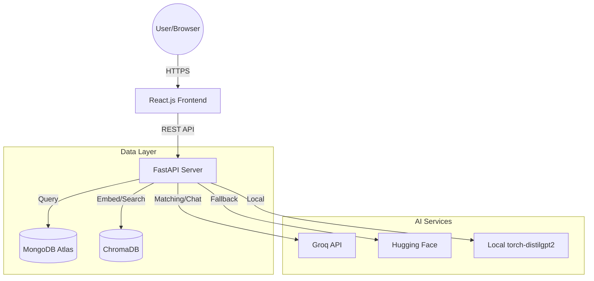

# System Design & Architecture - MAT-CHA.AI

## 1. High-Level Architecture
The system follows a standard Client-Server architecture with a specialized AI integration layer for semantic search and generation.

## 2. Component Design

### 2.1 Frontend Structure
- **Pages**:
  - `LandingPage.js`: Animated hero section, feature highlights, and CTA.
  - `AuthPage.js`: Unified login/signup with role selection.
  - `StartupDashboard.js`: Request management, match discovery, and deal tracking.
  - `CreatorDashboard.js`: Profile setup, portfolio feed, and active collaborations.
- **Components**:
  - `ChatDialog.js`: Floating chat interface with "Optimistic UI" updates.
  - `WriterMode.js`: AI-assisted content drafting interface.
  - `ThemeToggle.js`: System-wide dark/light mode switching.

### 2.2 Backend Services
- **Auth Service**: Password hashing (Bcrypt) and session management.
- **Matching Engine**: 
  - Converts creator profiles into vectors using `SentenceTransformers`.
  - Performs nearest-neighbor search in ChromaDB.
  - Refines results using LLM (Llama-3) for qualitative analysis.
- **Messaging Service**: 
  - Handles real-time polling.
  - Implements TTL (Time-To-Live) logic for message expiration (48h).

## 3. Data Schema

### 3.1 MongoDB Collections
- **Users**: `{ id, email, password_hash, role, name }`
- **Creator Profiles**: `{ creator_id, bio, platforms[], content_types[], stats: {followers, engagement} }`
- **Collab Requests**: `{ startup_id, title, description, budget, platform, content_type }`
- **Matches**: `{ collab_id, profile_id, score, analysis, status, startup_agreed, creator_agreed }`
- **Messages**: `{ match_id, sender_id, content, timestamp }`

### 3.2 Vector Storage (ChromaDB)
- **Document**: String representation of creator expertise.
- **Metadata**: `{ creator_id, name, platforms }`
- **Embedding**: 384-dimensional vector (all-MiniLM-L6-v2).

## 4. Design Patterns
1. **Optimistic UI**: The frontend updates state (e.g., sending a chat message) before the server confirms, reversing only on failure.
2. **Strategy Pattern**: The AI module uses a hierarchy of clients (Groq -> HF -> Local) to ensure maximum availability.
3. **Repository Pattern**: Data access logic is decoupled from API endpoints in `server.py` and `vector_store.py`.

## 5. Security & Deployment
- **CORS Handling**: Dynamic origin validation for AWS Amplify hosting.
- **Environment Management**: Separation of development and production via `.env`.
- **Hosting**:
  - **Frontend**: AWS Amplify (SPA routing enabled).
  - **Backend**: Render (Gunicorn/Uvicorn worker).
  - **Database**: Shared MongoDB Atlas cluster.
