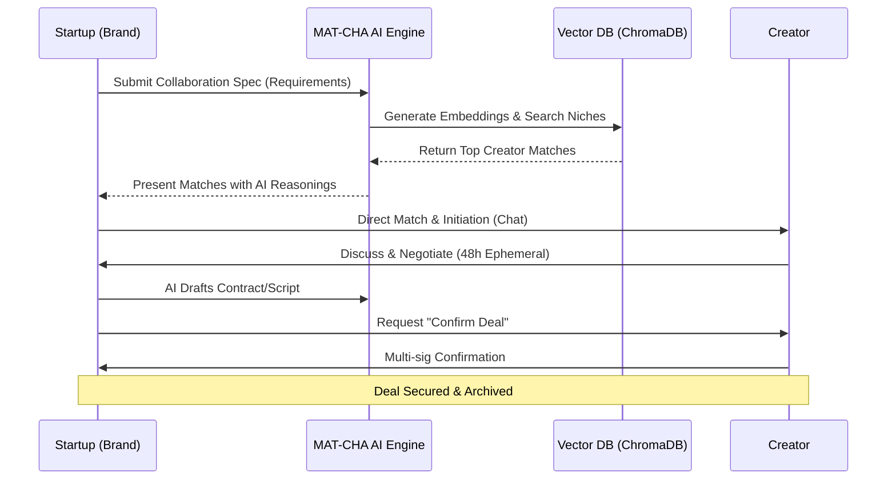
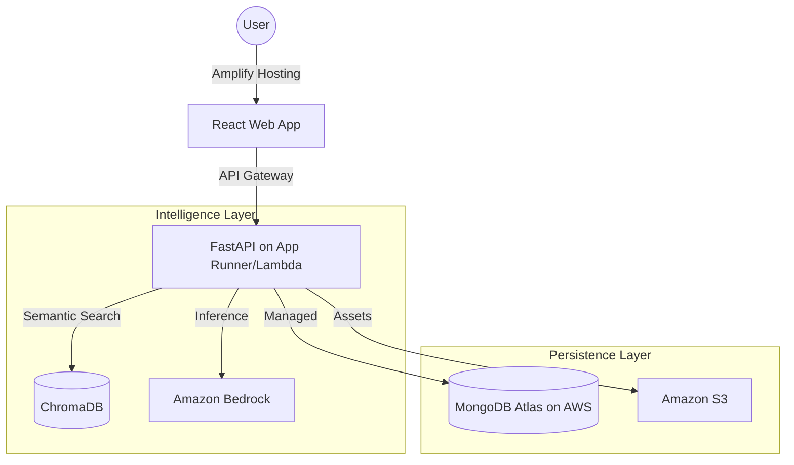

# System Design & Architecture - MAT-CHA.AI

## 1. Process Flow Diagram
The following diagram illustrates the end-to-end flow from discovery to deal confirmation, powered by Kiro's spec-driven AI logic.

## 2. High-Level Architecture (AWS Integrated)
Our architecture maximizes the use of AWS managed services for scalability and AI performance.

## 3. Tech Stack & AWS Services
| Component | Technology | AWS Service |
| :--- | :--- | :--- |
| **Frontend** | React 18, Tailwind CSS | **AWS Amplify** |
| **Backend** | FastAPI (Python 3.12) | **AWS App Runner** |
| **AI Matching** | Sentence-Transformers | **Amazon SageMaker** (Future) |
| **Generative AI** | Llama 3 / Claude 3 | **Amazon Bedrock** |
| **Primary Database**| MongoDB Atlas | Hosted on AWS |
| **Vector Storage** | ChromaDB | Containerized on EKS/Fargate |
| **Asset Storage** | Cloudinary / Local | **Amazon S3** |

## 4. Component Design

### 4.1 Spec-Driven Matching (Kiro Logic)
1. **Input**: Startup provides a natural language description of their campaign.
2. **Embedding**: The description is tokenized and converted into a vector.
3. **Retrieval**: ChromaDB performs a cosine-similarity search against indexed creator bios.
4. **Refinement**: **Amazon Bedrock** analyzes the top 5 candidates to provide a qualitative "Match Score" and custom reasoning.

### 4.2 Ephemeral Communication & Transparency
- **48h Message TTL**: Implemented via MongoDB TTL indexes to ensure data privacy and prompt action.
- **Optimistic Updates**: Using React Context to provide sub-second UI feedback during chat interactions.

## 5. Security & Availability
- **IAM Roles**: Least-privilege access for Bedrock and S3 integration.
- **Environment Management**: All secrets (API Keys, DB URIs) are managed via **AWS Secrets Manager**.
- **Edge Delivery**: Global distribution via Amplify CDN to ensure fast performance across different regions in India.

## 6. Development Workflow (Kiro)
This repository is built using Kiro's spec-driven development pattern:
1. Define requirements in `REQUIREMENTS.md`.
2. Map architecture in `DESIGN.md`.
3. Kiro generates the boilerplate and core logic based on these unified specifications.

## 7. Why This Solution Matters for India

### Economic Impact
- **Democratizes Marketing**: Enables 63M+ MSMEs in India to access affordable influencer marketing
- **Creator Monetization**: Unlocks earning potential for 80M+ content creators, especially in Tier 2/3 cities
- **Reduces Friction**: Eliminates expensive agency middlemen (typically 20-40% commission)

### Social Impact
- **Language & Cultural Fit**: Semantic matching helps brands find creators who speak regional languages and understand local culture
- **Digital Bharat**: Empowers small businesses in non-metro areas to compete in the digital economy
- **Skill Development**: Professionalizes creator-brand relationships, building business acumen

### Technical Innovation
- **AI-First Approach**: Leverages cutting-edge AWS AI services to solve a uniquely Indian problem at scale
- **Privacy-Conscious**: 48h ephemeral messaging respects data privacy concerns
- **Scalable Architecture**: Built on AWS to handle India's massive and growing digital population
