# MAT-CHA.AI MCP Server Architecture

## Overview

The MAT-CHA.AI MCP (Model Context Protocol) server exposes the platform's AI-powered matchmaking capabilities as standardized tools that can be consumed by AI assistants like Claude, Kiro, and other MCP-compatible clients.

## High-Level Architecture

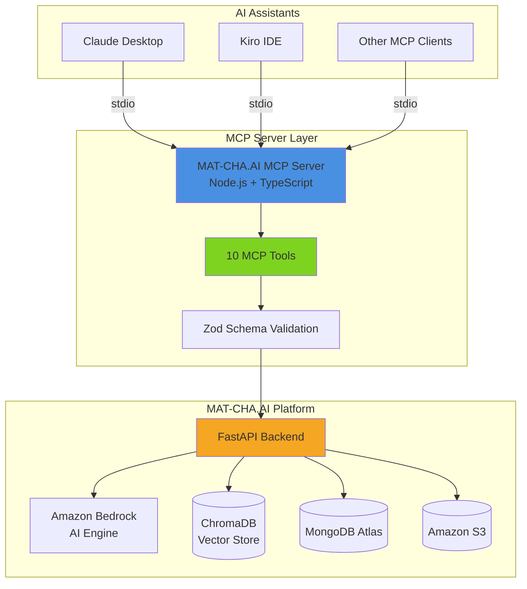

## MCP Tool Architecture

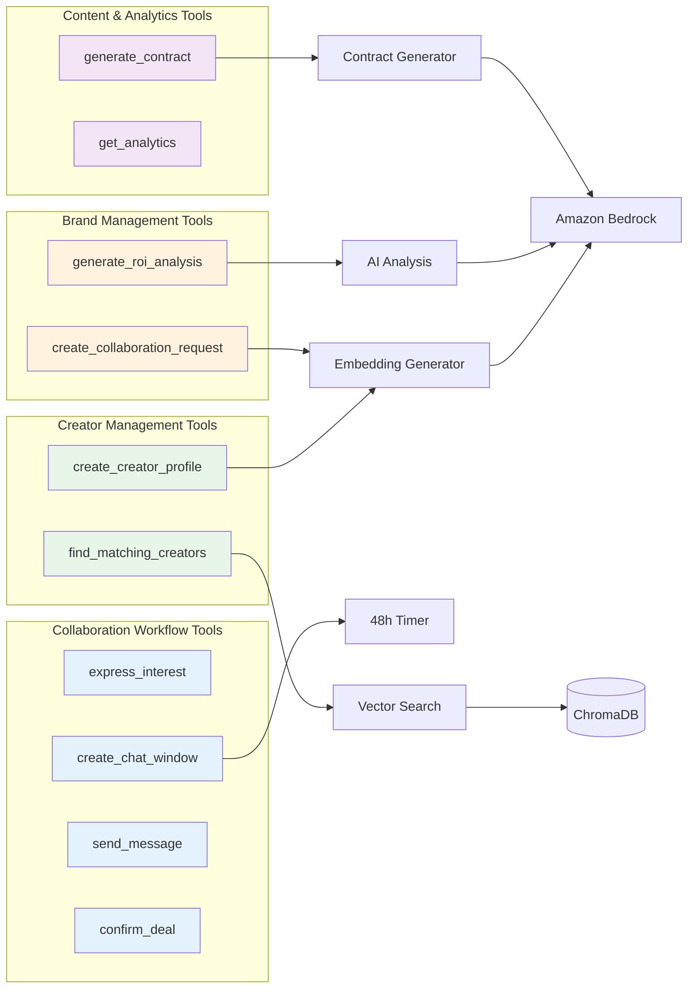

## Tool Interaction Flow

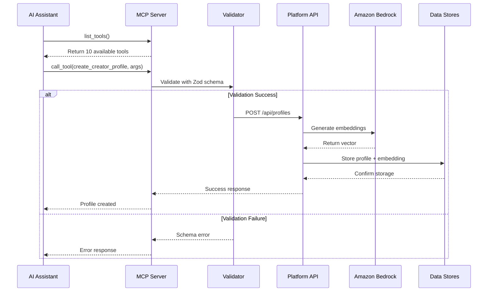

## Semantic Matching Flow

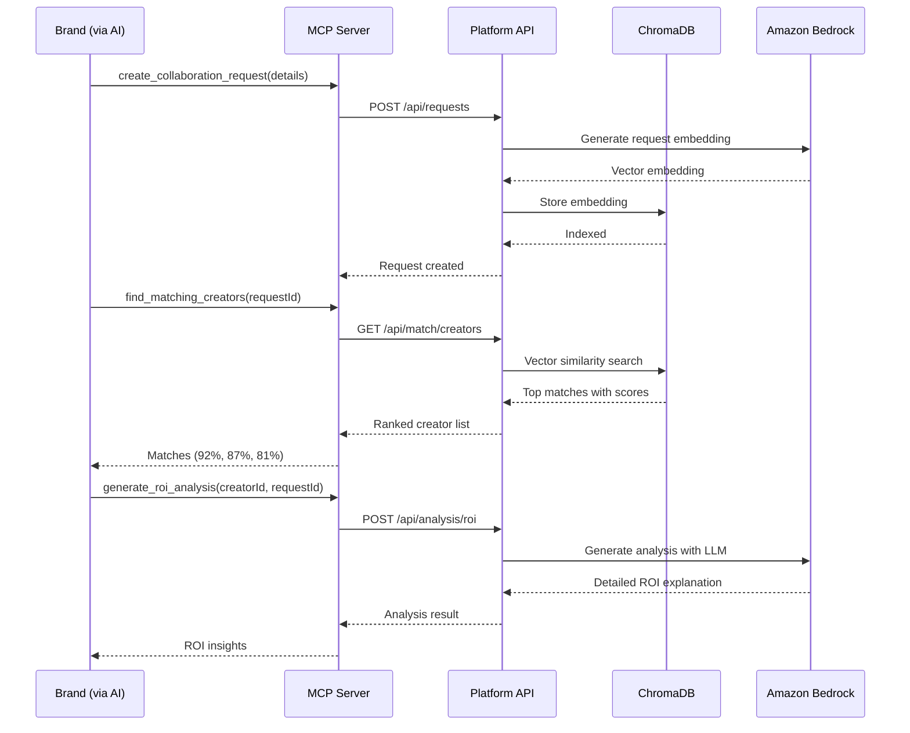

## Collaboration Workflow

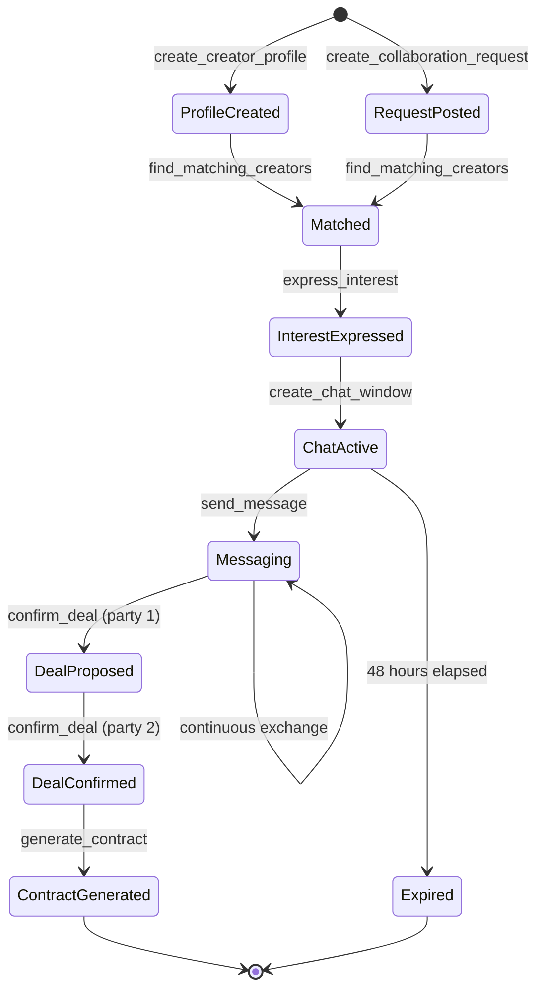

## Data Flow Architecture

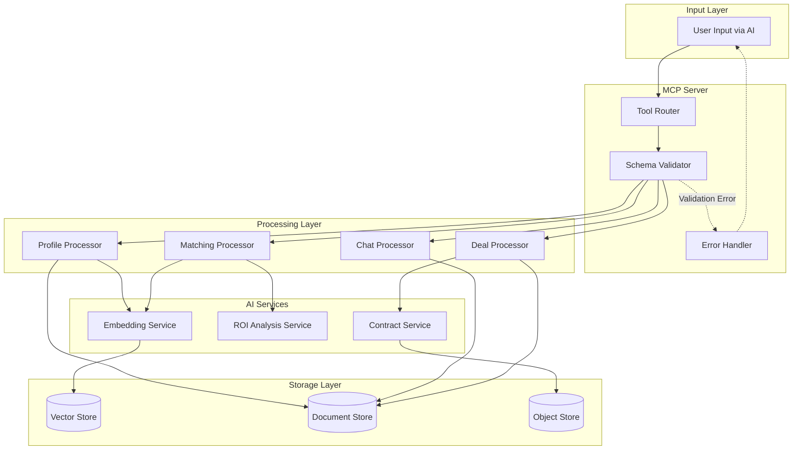

## Tool Categories and Capabilities

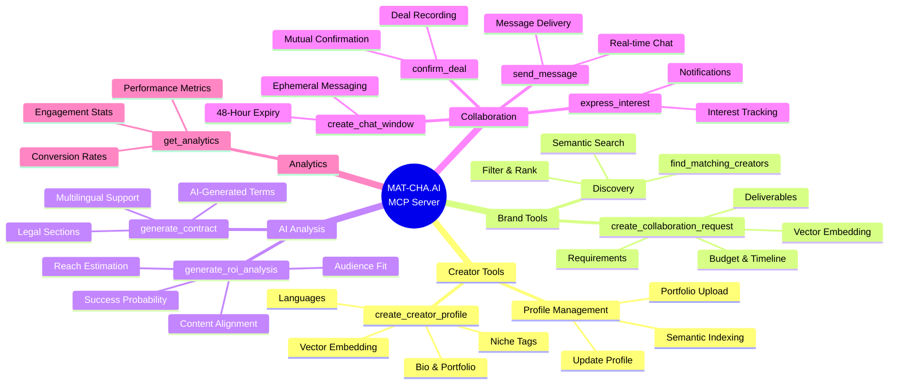

## Security and Validation Flow

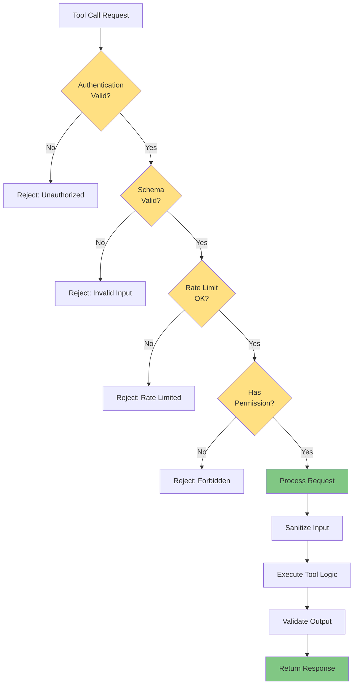

## Deployment Architecture

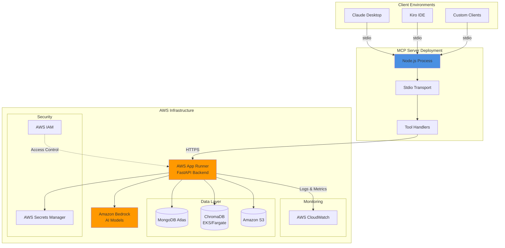

## Tool Response Format

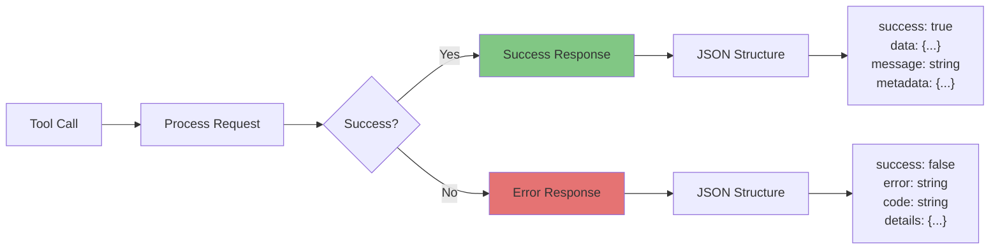

## Integration Points

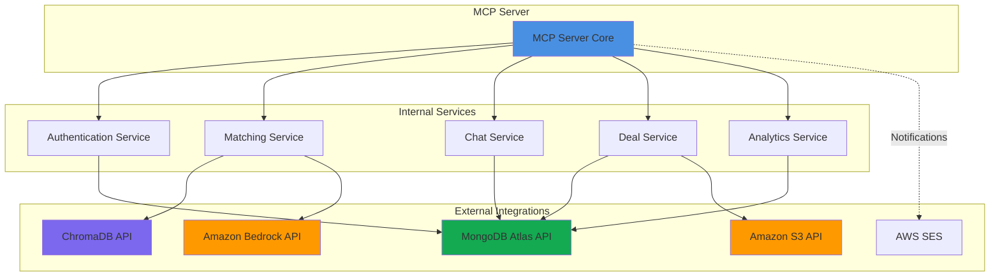

## Performance Optimization

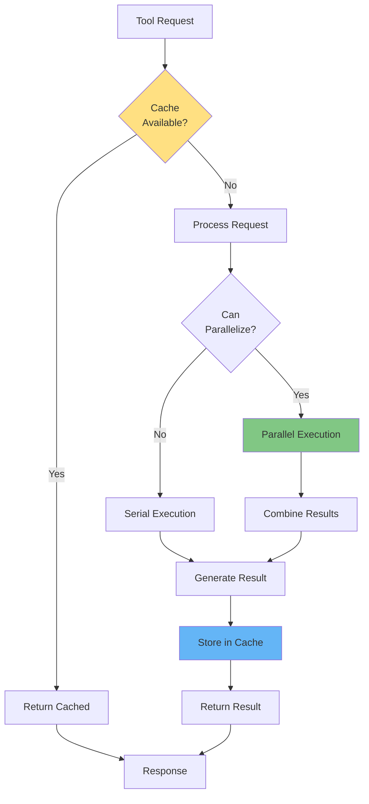

## Error Handling Strategy

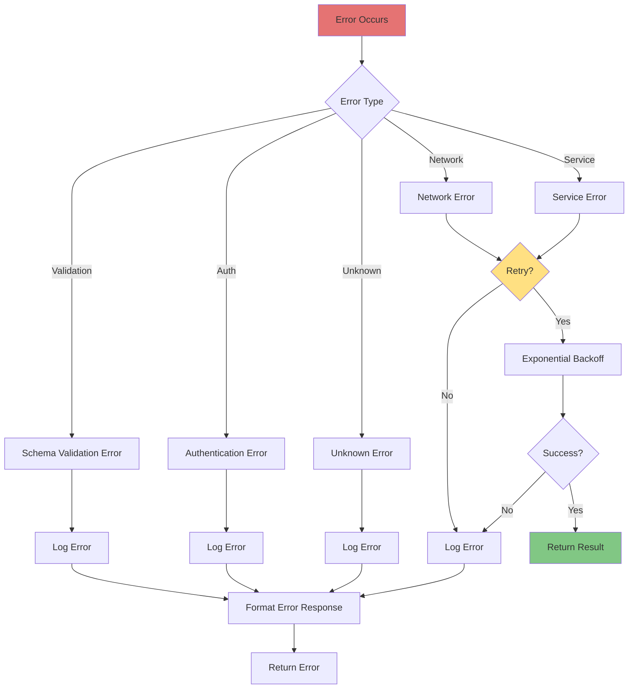

## Key Features

### 1. Semantic Matching
- Vector embeddings via Amazon Bedrock
- Cosine similarity scoring (0-100)
- Multi-language support

### 2. Ephemeral Communication
- 48-hour auto-expiring chat windows
- Real-time message delivery
- Countdown timers

### 3. AI-Powered Insights
- ROI analysis generation
- Contract template creation
- Success probability prediction

### 4. Mutual Confirmation
- Two-party deal confirmation
- Status tracking (pending/confirmed)
- Automated workflow transitions

### 5. Analytics & Reporting
- Performance metrics
- Conversion tracking
- Engagement analytics

## Technology Stack

- **Runtime**: Node.js 20+
- **Language**: TypeScript
- **MCP SDK**: @modelcontextprotocol/sdk
- **Validation**: Zod
- **Transport**: stdio
- **Backend**: FastAPI (Python)
- **AI**: Amazon Bedrock
- **Vector DB**: ChromaDB
- **Database**: MongoDB Atlas
- **Storage**: Amazon S3

## Configuration

The MCP server can be configured in:

### Kiro IDE
```json
{
  "mcpServers": {
    "mat-cha-ai": {
      "command": "node",
      "args": ["path/to/dist/index.js"],
      "disabled": false,
      "autoApprove": ["get_analytics"]
    }
  }
}
```

### Claude Desktop
```json
{
  "mcpServers": {
    "mat-cha-ai": {
      "command": "node",
      "args": ["path/to/dist/index.js"]
    }
  }
}
```

## Future Enhancements

1. **WebSocket Support**: Real-time bidirectional communication
2. **Batch Operations**: Process multiple requests efficiently
3. **Webhook Integration**: Event-driven notifications
4. **Advanced Caching**: Redis integration for distributed caching
5. **Rate Limiting**: Per-user and per-tool rate limits
6. **Audit Logging**: Comprehensive activity tracking
7. **Multi-tenancy**: Support for multiple platform instances
